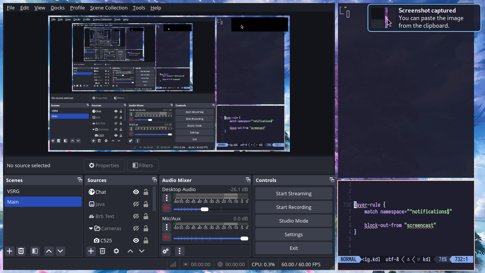

### 概述

<sup>Since: 25.01</sup>

图层规则允许你为单个 layer-shell 界面调整行为。
它们包含 `match` 和 `exclude` 指令，用于控制规则应该应用于哪些 layer-shell 界面，并提供了一系列可供你设置的属性。

图层规则的处理和工作方式与窗口规则非常相似，只是匹配器和属性不同。
请阅读[窗口规则的 wiki 页面](./Configuration:-Window-Rules.md)以了解匹配是如何工作的。

以下是图层规则可以拥有的所有匹配器和属性：

```kdl
layer-rule {
    match namespace="waybar"
    match at-startup=true

    // 持久生效的属性。
    opacity 0.5
    block-out-from "screencast"
    // block-out-from "screen-capture"

    shadow {
        on
        // off
        softness 40
        spread 5
        offset x=0 y=5
        draw-behind-window true
        color "#00000064"
        // inactive-color "#00000064"
    }

    geometry-corner-radius 12
    place-within-backdrop true
    baba-is-float true
}
```

### 图层界面匹配

让我们更仔细地看一下这些匹配器。

#### `namespace`

这是一个正则表达式，应匹配界面命名空间中的任何位置。
你可以阅读[此处文档](https://docs.rs/regex/latest/regex/#syntax)了解支持的正则表达式语法。

```kdl
// 匹配命名空间包含 "waybar" 的界面，
layer-rule {
    match namespace="waybar"
}
```

你可以通过运行 `niri msg layers` 找到所有打开的 layer-shell 界面的命名空间。

#### `at-startup`

可以是 `true` 或 `false`。
在启动 niri 后的前 60 秒内进行匹配。

```kdl
// 在 niri 启动时以 0.5 的不透明度显示 layer-shell 界面，之后不再显示。
layer-rule {
    match at-startup=true

    opacity 0.5
}
```

### 动态属性

这些属性持续生效于打开的 layer-shell 界面。

#### `block-out-from`

你可以阻止 xdg-desktop-portal 屏幕录制或所有屏幕捕获捕获界面。
它们将被替换为纯黑色矩形。

这对于通知可能很有用。

同样的注意事项和说明适用于 [`block-out-from` 窗口规则](./Configuration:-Window-Rules.md#block-out-from)，因此请查看那里的文档。



```kdl
// 阻止 mako 通知被屏幕录制捕获。
layer-rule {
    match namespace="^notifications$"

    block-out-from "screencast"
}
```

#### `opacity`

设置界面的不透明度。
`0.0` 是完全透明，`1.0` 是完全不透明。
这是在界面自身的不透明度之上应用的，因此半透明的界面将变得更加透明。

不透明度会单独应用于 layer-shell 界面的每个子项，因此子界面和弹出菜单将显示其后面的窗口内容。

```kdl
// 让 fuzzel 半透明。
layer-rule {
    match namespace="^launcher$"

    opacity 0.95
}
```

#### `shadow`

<sup>Since: 25.02</sup>

为界面覆盖阴影选项。

这些规则的选项与布局部分中的常规 [`shadow` 配置](./Configuration:-Layout.md#shadow)相同，因此请查阅那里的文档。

与窗口阴影不同，图层界面的阴影必须通过一条图层规则来启用。
也就是说，在布局配置部分启用阴影，并不会自动为图层界面启用它们。

> [!NOTE]
> 图层界面无法告知 niri 其*视觉几何形状*。
> 例如，如果图层界面包含一些不可见的边距（如 mako），niri 无法知道这一点，并将在整个界面（包括不可见的边距）后面绘制阴影。
>
> 因此，要使用 niri 阴影，你需要配置 layer-shell 客户端以移除它们自己的边距或阴影。

```kdl
// 为 fuzzel 添加阴影。
layer-rule {
    match namespace="^launcher$"

    shadow {
        on
    }

    // Fuzzel 默认设置为 10 像素圆角。
    geometry-corner-radius 10
}
```

#### `geometry-corner-radius`

<sup>Since: 25.02</sup>

设置界面的圆角半径。

此设置仅影响阴影——它将使阴影的角落变圆以匹配几何圆角半径。

```kdl
layer-rule {
    match namespace="^launcher$"

    geometry-corner-radius 12
}
```

#### `place-within-backdrop`

<sup>Since: 25.05</sup>

设置为 `true` 可将该界面放置到在[概览](./Overview.md)和工作区之间可见的背景中。

这仅适用于忽略独占区域的*背景*图层界面（壁纸工具的典型情况）。
背景内的图层将忽略所有输入。

```kdl
// 将 swaybg 放入概览背景中。
layer-rule {
    match namespace="^wallpaper$"

    place-within-backdrop true
}
```

#### `baba-is-float`

<sup>Since: 25.05</sup>

让你的图层界面上下浮动。

这个功能是[2025 年愚人节功能](./Configuration:-Window-Rules.md#baba-is-float)的正统续作。

```kdl
// 让 fuzzel 浮起来。
layer-rule {
    match namespace="^launcher$"

    baba-is-float true
}
```
