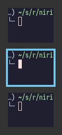
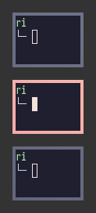
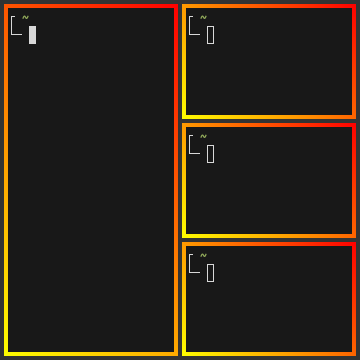
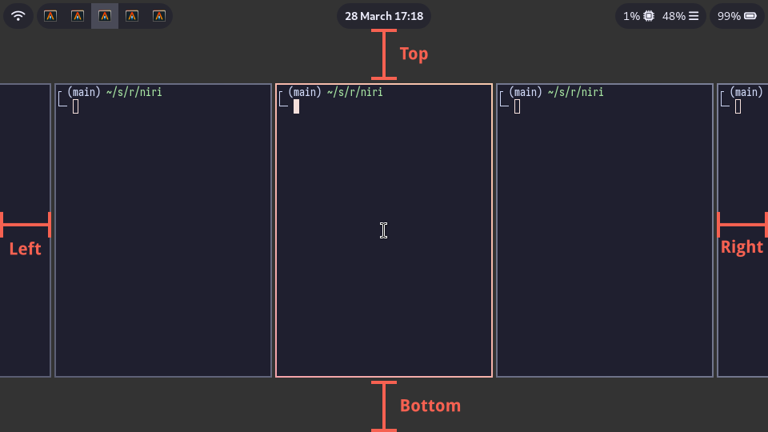

### 概述

在 `layout {}` 部分，您可以更改各种影响窗口定位和尺寸的设置。

以下是此部分的概览：

```kdl
layout {
    gaps 16
    center-focused-column "never"
    always-center-single-column
    empty-workspace-above-first
    default-column-display "tabbed"
    background-color "#003300"

    preset-column-widths {
        proportion 0.33333
        proportion 0.5
        proportion 0.66667
    }

    default-column-width { proportion 0.5; }

    preset-window-heights {
        proportion 0.33333
        proportion 0.5
        proportion 0.66667
    }

    focus-ring {
        // off
        on
        width 4
        active-color "#7fc8ff"
        inactive-color "#505050"
        urgent-color "#9b0000"
        // active-gradient from="#80c8ff" to="#bbddff" angle=45
        // inactive-gradient from="#505050" to="#808080" angle=45 relative-to="workspace-view"
        // urgent-gradient from="#800" to="#a33" angle=45
    }

    border {
        off
        // on
        width 4
        active-color "#ffc87f"
        inactive-color "#505050"
        urgent-color "#9b0000"
        // active-gradient from="#ffbb66" to="#ffc880" angle=45 relative-to="workspace-view"
        // inactive-gradient from="#505050" to="#808080" angle=45 relative-to="workspace-view" in="srgb-linear"
        // urgent-gradient from="#800" to="#a33" angle=45
    }

    shadow {
        off
        // on
        softness 30
        spread 5
        offset x=0 y=5
        draw-behind-window true
        color "#00000070"
        // inactive-color "#00000054"
    }

    tab-indicator {
        // off
        on
        hide-when-single-tab
        place-within-column
        gap 5
        width 4
        length total-proportion=1.0
        position "right"
        gaps-between-tabs 2
        corner-radius 8
        active-color "red"
        inactive-color "gray"
        urgent-color "blue"
        // active-gradient from="#80c8ff" to="#bbddff" angle=45
        // inactive-gradient from="#505050" to="#808080" angle=45 relative-to="workspace-view"
        // urgent-gradient from="#800" to="#a33" angle=45
    }

    insert-hint {
        // off
        on
        color "#ffc87f80"
        // gradient from="#ffbb6680" to="#ffc88080" angle=45 relative-to="workspace-view"
    }

    struts {
        // left 64
        // right 64
        // top 64
        // bottom 64
    }
}
```

<sup>Since: next release</sup> 您可以为特定的[输出](./Configuration:-Outputs.md#layout-config-overrides)和[命名工作区](./Configuration:-Named-Workspaces.md#layout-config-overrides)覆写这些设置。

### `gaps`

设置窗口周围（内部和外部）的间隙，以逻辑像素为单位。

<sup>Since: 0.1.7</sup> 您可以使用小数值。
改值将会按照每个输出的缩放因子被四舍五入换算为物理像素值。
例如，在 `scale 2` 的输出上使用 `gaps 0.5` 将产生 1 物理像素宽的间隙。

<sup>Since: 0.1.8</sup> 您可以使用负的 `struts` 值来模拟"内部"与"外部"间隙（参见下面的 struts 部分）。

```kdl
layout {
    gaps 16
}
```

### `center-focused-column`

在切换焦点时，何时将列居中。
可以设置为：

- `"never"`：没有特殊居中，聚焦屏幕外的列将使其滚动到屏幕的左边缘或右边缘。这是默认值。
- `"always"`：聚焦的列将始终居中。
- `"on-overflow"`：如果聚焦的列与先前聚焦的列一起无法在屏幕上完全显示，则使其居中。

```kdl
layout {
    center-focused-column "always"
}
```

### `always-center-single-column`

<sup>Since: 0.1.9</sup>

如果设置了该项，niri 将始终使工作区上的单列居中，无论 `center-focused-column` 选项如何设置。

```kdl
layout {
    always-center-single-column
}
```

### `empty-workspace-above-first`

<sup>Since: 25.01</sup>

如果设置，niri 将始终在最开头添加一个空工作区，此外还在最末尾也保留一个空工作区。

```kdl
layout {
    empty-workspace-above-first
}
```

### `default-column-display`

<sup>Since: 25.02</sup>

设置新列的默认显示模式。
可以是 `normal` 或 `tabbed`。

```kdl
// 使所有新列默认为标签式。
layout {
    default-column-display "tabbed"

    // 您可能还希望在只有一个窗口的列中
    // 隐藏标签指示器。
    tab-indicator {
        hide-when-single-tab
    }
}
```

### `preset-column-widths`

设置 `switch-preset-column-width` 动作（Mod+R）所切换的宽度。

`proportion` 将宽度设置为输出宽度的比例，并扣除了间隙。
例如，无论间隙设置多大，您都可以在一个输出上完美放置四个 `proportion 0.25` 宽度的窗口。
默认预设宽度是输出的 <sup>1</sup>&frasl;<sub>3</sub>, <sup>1</sup>&frasl;<sub>2</sub> 和 <sup>2</sup>&frasl;<sub>3</sub>。

`fixed` 将窗口宽度精确设置为指定的逻辑像素数。

```kdl
layout {
    // 在输出宽度的 1/3、1/2、2/3 以及固定的 1280 逻辑像素之间循环。
    preset-column-widths {
        proportion 0.33333
        proportion 0.5
        proportion 0.66667
        fixed 1280
    }
}
```

### `default-column-width`

设置新窗口的默认宽度。

语法与上面的 `preset-column-widths` 相同。

```kdl
layout {
    // 打开的新窗口的大小为输出的 1/3 。
    default-column-width { proportion 0.33333; }
}
```

您也可以让括号留空，这样窗口将自行决定其初始宽度。

```kdl
layout {
    // 新窗口自行决定其初始宽度。
    default-column-width {}
}
```

> [!NOTE]
> `default-column-width {}` 会导致 niri 在初始配置请求中发送 (0, H) 的尺寸。
>
> Wayland 协议里对此的[定义略显含糊](https://gitlab.freedesktop.org/wayland/wayland-protocols/-/issues/155)，因此某些客户端可能会误解。
> 无论如何 ，`default-column-width {}` 最实用的场景还是针对特定窗口，以[窗口规则](./Configuration:-Window-Rules.md#default-column-width)的形式书写，语法完全一样。

### `preset-window-heights`

<sup>Since: 0.1.9</sup>

设置 `switch-preset-window-height` 操作（Mod+Shift+R）所切换的高度。

`proportion` 将高度设置为输出高度的比例，扣除了间隙。
默认预设高度是输出的 <sup>1</sup>&frasl;<sub>3</sub>, <sup>1</sup>&frasl;<sub>2</sub> 和 <sup>2</sup>&frasl;<sub>3</sub>。

`fixed` 将高度精确设置为指定的逻辑像素数。

```kdl
layout {
    // 在输出高度的 1/3、1/2、2/3 以及固定的 720 逻辑像素之间循环。
    preset-window-heights {
        proportion 0.33333
        proportion 0.5
        proportion 0.66667
        fixed 720
    }
}
```

### `focus-ring` 和 `border` {#focus-ring-and-border}

焦点环和边框绘制在窗口周围，指示当前的活动窗口。
它们非常相似，并具有相同的配置选项。

不同之处在于，焦点环仅绘制在活动窗口周围，而边框绘制在所有窗口周围，并会影响它们的大小（窗口会缩小以便为边框腾出空间）。

| 焦点环                         | 边框                             |
| ------------------------------ | -------------------------------- |
|  |  |

> [!TIP]
> 默认情况下，焦点环和边框作为实心背景矩形在窗口后面渲染。
> 也就是说，它们会透过半透明窗口显示出来。
> 这是因为使用客户端装饰的窗口可以具有任意形状。
>
> 如果您不喜欢这样，您应该取消注释配置顶层的 [`prefer-no-csd` 设置](./Configuration:-Miscellaneous.md#prefer-no-csd)。
> Niri 将在同意省略客户端装饰的窗口周围绘制焦点环和边框。
>
> 或者，您可以使用 [`draw-border-with-background` 窗口规则](./Configuration:-Window-Rules.md#draw-border-with-background) 覆写此行为。

焦点环和边框具有以下选项。

```kdl
layout {
    // foces-ring 具有相同的选项。
    border {
        // 取消注释此行以禁用边框。
        // off

        // 边框宽度，单位为逻辑像素。
        width 4

        active-color "#ffc87f"
        inactive-color "#505050"

        // 请求您注意的窗口周围的边框颜色。
        urgent-color "#9b0000"

        // active-gradient from="#ffbb66" to="#ffc880" angle=45 relative-to="workspace-view"
        // inactive-gradient from="#505050" to="#808080" angle=45 relative-to="workspace-view" in="srgb-linear"
    }
}
```

#### 宽度

设置边框的粗细，单位为逻辑像素。

<sup>Since: 0.1.7</sup> 您可以使用小数值。
该值将根据每个输出的缩放比例四舍五入到物理像素。
例如，在 `scale 2` 的输出上使用 `width 0.5` 将得到一物理像素厚的边框。

```kdl
layout {
    border {
        width 2
    }
}
```

#### 颜色

颜色可以通过多种方式设置：

- CSS 命名颜色：`"red"`
- RGB 十六进制：`"#rgb"`, `"#rgba"`, `"#rrggbb"`
- CSS 风格表示法：`"rgb(255, 127, 0)"`, `"rgba()"`, `"hsl()"` 等等。

`active-color` 是活动窗口周围焦点环/边框的颜色，`inactive-color` 是所有其他窗口周围焦点环/边框的颜色。

*焦点环*仅绘制在每个显示器的活动窗口周围，因此在单个显示器上您永远不会看到其 `inactive-color`。
但是，如果您有多个显示器，则会看到它。

还有一种*已弃用*的语法，用四个数字分别代表 R、G、B 和 A 来表示颜色：`active-color 127 200 255 255`。

#### 渐变

与颜色类似，您可以设置 `active-gradient` 和 `inactive-gradient`，它们会优先生效。

渐变的渲染方式与 CSS [`linear-gradient(angle, from, to)`](https://developer.mozilla.org/en-US/docs/Web/CSS/gradient/linear-gradient) 完全一致。
角度的规则与 `linear-gradient` 相同，是可选的，默认为 `180`（自上而下渐变）。
您可以直接套用任何在线 CSS 渐变生成器的结果来设置，例如 [css-gradient.com](https://www.css-gradient.com/)。

```kdl
layout {
    focus-ring {
        active-gradient from="#80c8ff" to="#bbddff" angle=45
    }
}
```

渐变的颜色既可以相对于单个窗口计算（默认行为），也可以相对于整个工作区的可视区域计算。
如需后者，请设置 `relative-to="workspace-view"`。
图示如下：

| 默认                             | `relative-to="workspace-view"`                      |
| -------------------------------- | --------------------------------------------------- |
|  |  |

```kdl
layout {
    border {
        active-gradient from="#ffbb66" to="#ffc880" angle=45 relative-to="workspace-view"
        inactive-gradient from="#505050" to="#808080" angle=45 relative-to="workspace-view"
    }
}
```

<sup>Since: 0.1.8</sup> 您可以使用如 `in="srgb-linear"` 或 `in="oklch longer hue"` 这样的语法来设置渐变插值颜色空间。
支持的颜色空间有：

- `srgb`（默认），
- `srgb-linear`，
- `oklab`，
- `oklch` 与 `longer hue` 或 `shorter hue`、`increasing hue`、`decreasing hue`。

它们的渲染效果与 CSS 完全一致。
例如，`active-gradient from="#f00f" to="#0f05" angle=45 in="oklch longer hue"` 看起来就和这段 CSS `linear-gradient(45deg in oklch longer hue, #f00f, #0f05)` 相同。


```kdl
layout {
    border {
        active-gradient from="#f00f" to="#0f05" angle=45 in="oklch longer hue"
    }
}
```

### `shadow`

<sup>Since: 25.02</sup>

在窗口后面渲染的阴影。

设置 `on` 以启用阴影。

`softness` 控制阴影的柔和度/大小，单位为逻辑像素，与 [CSS 盒阴影] 的*模糊半径*相同。
设置 `softness 0` 将给产生硬阴影。

`spread` 是窗口矩形向外扩展的距离，单位为逻辑像素，与 CSS 盒阴影扩展相同。
<sup>Since: 25.05</sup> 扩展可以设为负值。

`offset` 相对于窗口移动阴影，单位为逻辑像素，与 CSS 盒阴影偏移相同。
例如，`offset x=2 y=2` 会将阴影分别向下和向右移动 2 个逻辑像素。

将 `draw-behind-window` 设置为 `true` 可使阴影绘制在窗口后面，而不仅仅是窗口周围。
请注意，niri 无法得知 CSD 窗口的圆角半径。
它必须假设窗口具有直角，这会导致 CSD 圆角内部出现阴影伪影。
此设置可修复这些伪影。

但是，更推荐的做法是设置 `prefer-no-csd` 和/或 `geometry-corner-radius`。
这样，niri 就能知道窗口的圆角半径，无需再把阴影绘制在窗口背后，也能正确渲染圆角阴影。
同时，如果窗口自己带了客户端阴影，这两个选项还会把那些阴影一并去掉。

`color` 是阴影的颜色和不透明度。

`inactive-color` 允许您覆写非活动窗口的阴影颜色；默认情况下，会使用更透明的 `color`。

阴影绘制将遵循 [`geometry-corner-radius` 窗口规则](./Configuration:-Window-Rules.md#geometry-corner-radius) 设置的窗口圆角半径。

> [!NOTE]
> 目前阴影绘制仅支持四个角统一半径。如果您将 `geometry-corner-radius` 设置为四个值而不是一个，阴影会直接取用第一个值（左上角）角的半径作为统一半径。

```kdl
// 启用阴影。
layout {
    shadow {
        on
    }
}

// 同时要求窗口省略客户端装饰，这样
// 它们就不会绘制自己的窗口阴影。
prefer-no-csd
```

[CSS box-shadow]: https://developer.mozilla.org/en-US/docs/Web/CSS/box-shadow

### `tab-indicator`

<sup>Since: 25.02</sup>

控制标签指示器的外观，该指示器出现在以标签形式显示的列旁边。

设置为 `off` 以隐藏标签指示器。

设置 `hide-when-single-tab` 以隐藏仅有一个窗口的标签页列的指示器。

设置 `place-within-column` 将标签指示器放在列“内部”，而不是外部。
这将使其包含在列尺寸的计算中，并避免与相邻列重叠。

`gap` 设置标签指示器与窗口之间的间隙，单位为逻辑像素。
间隙可以为负，这会将标签指示器置于窗口上方。

`width` 设置指示器的粗细，单位为逻辑像素。

`length` 控制指示器的长度。
将 `total-proportion` 属性设置成多少，指示器就占窗口长度的多大比例。
默认情况下，标签指示器的长度是窗口大小的一半，即 `length total-proportion=0.5`。

`position` 设置标签指示器相对于窗口的位置。
可以是 `left`、`right`、`top` 或 `bottom`。

`gaps-between-tabs` 控制各个标签之间的间隙，单位为逻辑像素。

`corner-radius` 设置指示器中标签的圆角半径，单位为逻辑像素。
当 `gaps-between-tabs` 为零时，只有第一个和最后一个标签有圆角，否则所有标签都有圆角。

`active-color`、`inactive-color`、`urgent-color`、`active-gradient`、`inactive-gradient`、`urgent-gradient` 允许您覆写标签的颜色。
它们具有与边框和焦点环颜色、渐变相同的语义。

标签颜色按以下顺序选取：
1. 若通过 `tab-indicator` 窗口规则设置了颜色，则采用该设置。
2. 若未设置窗口规则，则使用此处 `tab-indicator` 布局选项中的颜色（您正在看的这部分）。
3. 若两者都未设置，niri 会退而采用当前窗口的边框或焦点环颜色，以正在生效的那一项为准。

```kdl
// 使标签指示器更宽，与列高匹配，
// 同时将其放在顶部和列内部。
layout {
    tab-indicator {
        width 8
        gap 8
        length total-proportion=1.0
        position "top"
        place-within-column
    }
}
```

### `insert-hint`

<sup>Since: 0.1.10</sup>

交互式移动窗口期间窗口插入位置提示的设置。

`off` 完全禁用插入提示。

`color` 和 `gradient` 允许您更改提示的颜色，并且具有与边框和焦点环中的颜色和渐变相同的语法。

```kdl
layout {
    insert-hint {
        // off
        color "#ffc87f80"
        gradient from="#ffbb6680" to="#ffc88080" angle=45 relative-to="workspace-view"
    }
}
```

### `struts`

Struts 会缩小窗口所占用的区域，类似于 layer-shell 面板。
您可以将其视为一种外部间隙。
它们以逻辑像素为单位设置。

左右 struts 会让侧面的下一个窗口永远露出来一点点。
上下 struts 只是简单地在 layer-shell 面板和常规间隙之外再额外加一道外间隙。

<sup>Since: 0.1.7</sup> 您可以使用小数值。
该值将根据每个输出的缩放因子四舍五入为物理像素。
例如，在 `scale 2` 的输出上使用 `top 0.5` 将导致 1 物理像素宽的顶部 strut。

```kdl
layout {
    struts {
        left 64
        right 64
        top 64
        bottom 64
    }
}
```



<sup>Since: 0.1.8</sup> 您可以使用负值。
它们会将窗口向外推，甚至推到屏幕边缘之外。

您可以把 struts 设为负数，在配合对应的 gaps 值，来模拟"内部"与"外部"间隙。
例如，使用此设置可以实现内部间隙而无外部间隙：：

```kdl
layout {
    gaps 16

    struts {
        left -16
        right -16
        top -16
        bottom -16
    }
}
```

### `background-color`

<sup>Since: 25.05</sup>

设置 niri 为工作区绘制的默认背景颜色。
当您未使用任何背景工具（如 swaybg）时，就能看到这个颜色。

```kdl
layout {
    background-color "#003300"
}
```

您还可以在每个输出的[输出配置](./Configuration:-Outputs.md#layout-config-overrides)中设置颜色。
