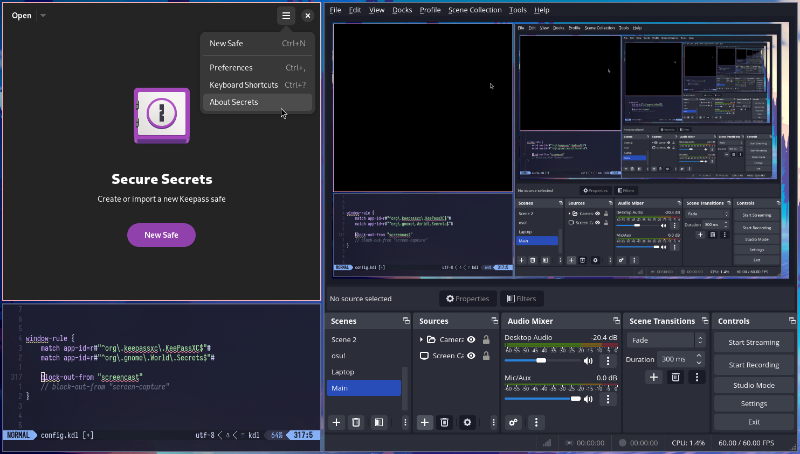
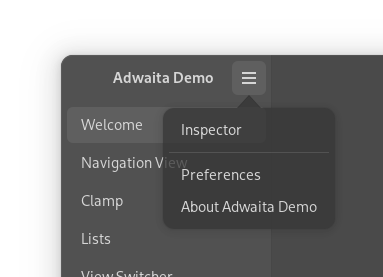
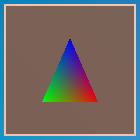
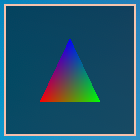
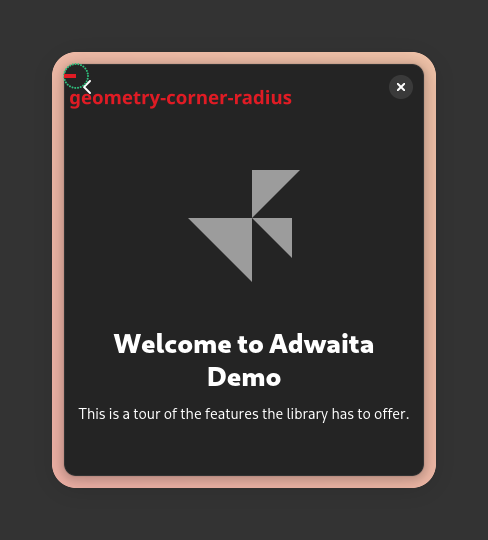
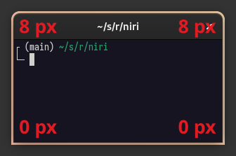
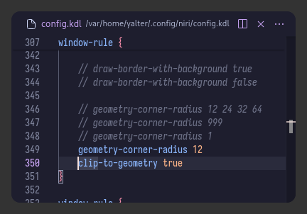
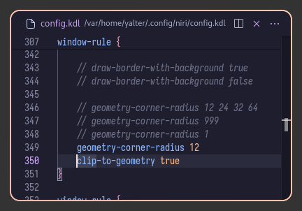

### 概述

窗口规则允许你调整单个窗口的行为。
它们包含 `match` 和 `exclude` 指令，用于控制规则应对哪些窗口生效，以及一系列可供您设置的属性。

窗口规则会按照它们在配置文件中出现的顺序进行处理。
这意味着你可以将更通用的规则放在前面，然后在后面为特定窗口覆写它们。
例如：

```kdl
// 为所有窗口设置 open-maximized 为 true。
window-rule {
    open-maximized true
}

// 然后，对于 Alacritty，将 open-maximized 设置回 false。
window-rule {
    match app-id="Alacritty"
    open-maximized false
}
```

> [!TIP]
> 通常来说，你无法在后续规则中“取消设置”某个属性，只能将其设置为不同的值。
> 使用 `exclude` 指令来避免对特定窗口应用某个规则。

以下是窗口规则可以拥有的所有匹配器和属性：

```kdl
window-rule {
    match title="Firefox"
    match app-id="Alacritty"
    match is-active=true
    match is-focused=false
    match is-active-in-column=true
    match is-floating=true
    match is-window-cast-target=true
    match is-urgent=true
    match at-startup=true

    // 在窗口打开时生效一次的属性。
    default-column-width { proportion 0.75; }
    default-window-height { fixed 500; }
    open-on-output "Some Company CoolMonitor 1234"
    open-on-workspace "chat"
    open-maximized true
    open-fullscreen true
    open-floating true
    open-focused false

    // 持久生效的属性。
    draw-border-with-background false
    opacity 0.5
    block-out-from "screencast"
    // block-out-from "screen-capture"
    variable-refresh-rate true
    default-column-display "tabbed"
    default-floating-position x=100 y=200 relative-to="bottom-left"
    scroll-factor 0.75

    focus-ring {
        // off
        on
        width 4
        active-color "#7fc8ff"
        inactive-color "#505050"
        urgent-color "#9b0000"
        // active-gradient from="#80c8ff" to="#bbddff" angle=45
        // inactive-gradient from="#505050" to="#808080" angle=45 relative-to="workspace-view"
        // urgent-gradient from="#800" to="#a33" angle=45
    }

    border {
        // 和 focus-ring 一样。
    }

    shadow {
        // on
        off
        softness 40
        spread 5
        offset x=0 y=5
        draw-behind-window true
        color "#00000064"
        // inactive-color "#00000064"
    }

    tab-indicator {
        active-color "red"
        inactive-color "gray"
        urgent-color "blue"
        // active-gradient from="#80c8ff" to="#bbddff" angle=45
        // inactive-gradient from="#505050" to="#808080" angle=45 relative-to="workspace-view"
        // urgent-gradient from="#800" to="#a33" angle=45
    }

    geometry-corner-radius 12
    clip-to-geometry true
    tiled-state true
    baba-is-float true

    min-width 100
    max-width 200
    min-height 300
    max-height 300
}
```

### 窗口匹配

每个窗口规则可以包含多个 `match` 和 `exclude` 指令。
要想使规则生效，一个窗口需要满足*任意*一个 `match` 指令的条件，并且*不能满足任何* `exclude` 指令的条件。

```kdl
window-rule {
    // 匹配所有 Telegram 窗口...
    match app-id=r#"^org\.telegram\.desktop$"#

    // ...除了（Telegram的）媒体查看器窗口。
    exclude title="^Media viewer$"

    // 需要应用的属性。
    open-on-output "HDMI-A-1"
}
```

匹配和排除指令具有相同的语法。
一条指令中可以拥有多个*匹配器*，窗口必须满足所有条件，该指令才会生效。

```kdl
window-rule {
    // 匹配标题中包含 Gmail 的 Firefox 窗口。
    match app-id="firefox" title="Gmail"
}

window-rule {
    // 匹配 Firefox，但仅当它处于活动状态时...
    match app-id="firefox" is-active=true

    // ...或者匹配 Telegram...
    match app-id=r#"^org\.telegram\.desktop$"#

    // ...但是不匹配 Telegram 的媒体查看器。
    // 如果你在 Firefox 中打开一个标题为 "Media viewer" 的标签页，
    // 它不会被排除，因为它不满足此排除指令的 app-id 条件。
    exclude app-id=r#"^org\.telegram\.desktop$"# title="Media viewer"
}
```

让我们更详细地了解一下这些匹配器。

#### `title` 和 `app-id`

这些是正则表达式，应分别匹配窗口标题和应用 ID 中的任意位置。
你可以在[此处](https://docs.rs/regex/latest/regex/#syntax)了解支持的正则表达式语法。

```kdl
// 匹配标题包含 "Mozilla Firefox" 的窗口，
// 或应用 ID 包含 "Alacritty" 的窗口。
window-rule {
    match title="Mozilla Firefox"
    match app-id="Alacritty"
}
```

原生 KDL 字符串在编写正则表达式时会很有帮助：

```kdl
window-rule {
    exclude app-id=r#"^org\.keepassxc\.KeePassXC$"#
}
```

你可以通过运行 `niri msg pick-window` 并点击相关窗口来获取到该窗口的标题和应用 ID。

> [!TIP]
> 另一种查找窗口标题和应用 ID 的方法是在 [Waybar](https://github.com/Alexays/Waybar) 中配置 `wlr/taskbar` 模块，这样就可以将它们包含在提示信息中：
>
> ```json
> "wlr/taskbar": {
>     "tooltip-format": "{title} | {app_id}",
> }
> ```

#### `is-active`

可以是 `true` 或 `false`。
匹配活动窗口（即具有活动边框/焦点环颜色的窗口）。

在当前获得焦点的显示器上，每个工作区都会有一个活动窗口。
这意味着，您通常会有多个活动窗口（每个工作区各一个），并且在切换工作区时，您会同时看到两个处于活动状态的窗口。

```kdl
window-rule {
    match is-active=true
}
```

#### `is-focused`

可以是 `true` 或 `false`。
匹配具有键盘焦点的窗口。

与 `is-active` 相反，键盘焦点只能有一个获得焦点的窗口。
此外，当打开一个 layer-shell 应用程序启动器或弹出菜单时，键盘焦点会转移到  layer-shell 上。
当 layer-shell 拥有键盘焦点时，窗口将不会匹配此规则。

```kdl
window-rule {
    match is-focused=true
}
```

#### `is-active-in-column`

<sup>Since: 0.1.6</sup>

可以是 `true` 或 `false`。
匹配在其列中处于“活动”状态的窗口。

与 `is-active` 不同，每一列中始终会有一个 `is-active-in-column` 窗口。
它指的是该列中最后获得焦点的窗口，即当该列获得焦点时，将会接收到焦点的那个窗口。

<sup>Since: 25.01</sup> 在窗口初始打开时，此规则将匹配为 `true`。

```kdl
window-rule {
    match is-active-in-column=true
}
```

#### `is-floating`

<sup>Since: 25.01</sup>

可以是 `true` 或 `false`。
匹配浮动窗口。

> [!NOTE]
> 此匹配器仅在窗口已经打开后才会应用。
> 这意味着你不能使用它来更改窗口的打开属性，如 `default-window-height` 或 `open-on-workspace`。

```kdl
window-rule {
    match is-floating=true
}
```

#### `is-window-cast-target`

<sup>Since: 25.02</sup>

可以是 `true` 或 `false`。
对于那写正在进行窗口屏幕录制的目标窗口，匹配为 `true`。

> [!NOTE]
> 这仅匹配单个窗口的屏幕录制。
> 例如，它不会匹配在显示器屏幕录制中恰好可见的窗口。

```kdl
// 用红色指示正在被屏幕录制的窗口。
window-rule {
    match is-window-cast-target=true

    focus-ring {
        active-color "#f38ba8"
        inactive-color "#7d0d2d"
    }

    border {
        inactive-color "#7d0d2d"
    }

    shadow {
        color "#7d0d2d70"
    }

    tab-indicator {
        active-color "#f38ba8"
        inactive-color "#7d0d2d"
    }
}
```

示例：


#### `is-urgent`

<sup>Since: 25.05</sup>

可以是 `true` 或 `false`。
匹配请求用户注意的窗口。

```kdl
window-rule {
    match is-urgent=true
}
```

#### `at-startup`

<sup>Since: 0.1.6</sup>

可以是 `true` 或 `false`。
在启动 niri 后的前 60 秒内匹配。

这对于像 `open-on-output` 这样的属性很有用，你可能希望仅在启动 niri 后的一段时间内应用它们。

```kdl
// 在 niri 启动时，在 HDMI-A-1 显示器上打开窗口，但之后不这样做。
window-rule {
    match at-startup=true
    open-on-output "HDMI-A-1"
}
```

### 窗口打开属性

这些属性在窗口首次打开时应用一次。

准确地说，它们在 niri 向窗口发送初始配置请求时应用。

#### `default-column-width`

为新窗口设置默认宽度。

尽管名称中有“column”，但其实这也适用于浮动窗口。

```kdl
// 在打开时为 Blender 和 GIMP 提供足够的宽度。
window-rule {
    match app-id="^blender$"

    // GIMP 应用 ID 包含版本号，如 "gimp-2.99"，
    // 所以我们只匹配开头（用 ^）而不匹配结尾。
    match app-id="^gimp"

    default-column-width { fixed 1200; }
}
```

#### `default-window-height`

<sup>Since: 25.01</sup>

为新窗口设置默认高度。

```kdl
// 以浮动窗口打开 Firefox 画中画窗口，大小为 480×270 。
window-rule {
    match app-id="firefox$" title="^Picture-in-Picture$"

    open-floating true
    default-column-width { fixed 480; }
    default-window-height { fixed 270; }
}
```

#### `open-on-output`

使窗口在特定的输出上打开。

如果这样的输出不存在，窗口将照常地在当前聚焦的输出上打开。

如果窗口在当前未获得焦点的输出上打开，该窗口将不会自动获得焦点。

```kdl
// 在特定的显示器上打开 Firefox 和 Telegram（但不包括其媒体查看器）。
window-rule {
    match app-id="firefox$"
    match app-id=r#"^org\.telegram\.desktop$"#
    exclude app-id=r#"^org\.telegram\.desktop$"# title="^Media viewer$"

    open-on-output "HDMI-A-1"
    // 或者：
    // open-on-output "Some Company CoolMonitor 1234"
}
```

<sup>Since: 0.1.9</sup> `open-on-output` 现在可以使用显示器的制造商、型号和序列号。
在此版本之前，它只能使用连接器名称。

#### `open-on-workspace`

<sup>Since: 0.1.6</sup>

使窗口在特定的[命名工作区](./Configuration:-Named-Workspaces.md)上打开。

如果这样的工作区不存在，窗口将照常地在当前聚焦的工作区上打开。

如果窗口在当前未获得焦点的输出上打开，该窗口将不会自动获得焦点。

```kdl
// 在 "chat" 工作区上打开 Fractal。
window-rule {
    match app-id=r#"^org\.gnome\.Fractal$"#

    open-on-workspace "chat"
}
```

#### `open-maximized`

使窗口作为最大化列打开。

```kdl
// 默认最大化 Firefox。
window-rule {
    match app-id="firefox$"

    open-maximized true
}
```

#### `open-fullscreen`

使窗口全屏打开。

```kdl
window-rule {
    open-fullscreen true
}
```

你也可以将其设置为 `false` 以*阻止*窗口全屏打开。

```kdl
// 让 Telegram 媒体查看器以窗口模式打开。
window-rule {
    match app-id=r#"^org\.telegram\.desktop$"# title="^Media viewer$"

    open-fullscreen false
}
```

#### `open-floating`

<sup>Since: 25.01</sup>

使窗口以浮动布局打开。

```kdl
// 让 Firefox 画中画窗口作为浮动窗口打开。
window-rule {
    match app-id="firefox$" title="^Picture-in-Picture$"

    open-floating true
}
```

你也可以将其设置为 `false` 以*阻止*窗口以浮动布局打开。

```kdl
// 在平铺布局中打开所有窗口，覆盖任何自动浮动逻辑。
window-rule {
    open-floating false
}
```

#### `open-focused`

<sup>Since: 25.01</sup>

将此项设置为 `false` 以防止此窗口在打开时自动获取焦点。

```kdl
// 不要将焦点给予 GIMP 启动画面。
window-rule {
    match app-id="^gimp" title="^GIMP Startup$"

    open-focused false
}
```

你也可以将其设置为 `true` 来聚焦窗口，即使通常情况下它不会自动获得焦点。

```kdl
// 始终聚焦 KeePassXC-Browser 解锁对话框。
//
// 此对话框作为 KeePassXC 窗口的子窗口打开，而不是浏览器的，
// 因此默认情况下它不会自动获得焦点。
window-rule {
    match app-id=r#"^org\.keepassxc\.KeePassXC$"# title="^Unlock Database - KeePassXC$"

    open-focused true
}
```

### 动态属性

这些属性持久生效于已打开的窗口。

#### `block-out-from`

你可以阻止窗口出现在 xdg-desktop-portal 屏幕录制中。
它们将被替换为纯黑色矩形。

这对于密码管理器或聊天窗口等很有用。
对于 layer-shell 通知弹出窗口等类似的玩意儿，你可以使用 [`block-out-from` 层规则](./Configuration:-Layer-Rules.md#block-out-from)。



要预览和设置此规则，请检查配置中调试（debug）部分的 `preview-render` 选项。

> [!CAUTION]
> 该窗口在第三方截图工具中**不会**被屏蔽
> 如果你在屏幕录制时打开某个带预览的截图工具，被阻止的窗口**将在屏幕录制中可见**。

不过，内置的截图界面不受此问题影响。
若在录屏期间打开截图界面，您将能正常看到所有窗口并选择截图区域，但在最终的录屏画面中，该选择界面会显示出来，而其中的窗口则会被屏蔽。

```kdl
// 在屏幕录制中屏蔽密码管理器。
window-rule {
    match app-id=r#"^org\.keepassxc\.KeePassXC$"#
    match app-id=r#"^org\.gnome\.World\.Secrets$"#

    block-out-from "screencast"
}
```

或者，你可以将窗口从*所有*屏幕捕获中屏蔽，包括第三方截图工具。
这样，在打开第三方截图预览时，你就可以避免该窗口在屏幕录制中被意外显示。

此设置仍然允许你使用交互式内置截图界面，但它会阻止窗口出现在完全自动的截图操作中，例如 `screenshot-screen` 和 `screenshot-window`。
这样做的原因是，通过交互式选择，你可以确保避免截取敏感内容。

```kdl
window-rule {
    block-out-from "screen-capture"
}
```

> [!WARNING]
> 根据动态变化的窗口标题来屏蔽窗口时要小心。
>
> 例如，你可能会尝试像这样阻止特定的 Firefox 标签页：
>
> ```kdl
> window-rule {
>     // 不太起作用！尝试阻止 Gmail 标签页。
>     match app-id="firefox$" title="- Gmail "
>
>     block-out-from "screencast"
> }
> ```
>
> 它会起作用，但是当从一个敏感标签页切换到一个普通标签页时，敏感标签页的内容**会在屏幕录制中显示**一瞬间。
>
> 这是因为在 Wayland 协议中，窗口标题（和应用 ID）并未实现双缓冲，因此它们与特定的窗口内容并不绑定。
> Firefox 无法以一种可靠的方式，来同步“切换到另一个可见标签页”和“更改窗口标题”这两个操作。

#### `opacity`

设置窗口的不透明度。
`0.0` 是完全透明，`1.0` 是完全不透明。
这是在窗口自身的不透明度之上应用的，因此半透明窗口将变得更加透明。

不透明度会单独应用于窗口的每个界面，因此子界面和弹出菜单将显示其背后的窗口内容。



此外，焦点环和带背景的边框将在半透明窗口后显示（参见下面的 `prefer-no-csd` 和 `draw-border-with-background` 窗口规则）。

可以使用 [`toggle-window-rule-opacity`](./Configuration:-Key-Bindings.md#toggle-window-rule-opacity) 动作为窗口切换不透明度的开或关。

```kdl
// 使非活动窗口半透明。
window-rule {
    match is-active=false

    opacity 0.95
}
```

#### `variable-refresh-rate`

<sup>Since: 0.1.9</sup>

如果设置为 true，每当此窗口在支持按需 VRR 的输出上显示时，它将在该输出上启用 VRR。

```kdl
// 配置某个支持按需 VRR 的输出。
output "HDMI-A-1" {
    variable-refresh-rate on-demand=true
}

// 当 mpv 在该输出上显示时启用按需 VRR。
window-rule {
    match app-id="^mpv$"

    variable-refresh-rate true
}
```

#### `default-column-display`

<sup>Since: 25.02</sup>

为从此窗口创建的列设置默认显示模式。

这在窗口进入自己的列时使用。
例如：
- 打开一个新窗口。
- 将一个窗口剔出成独立的列。
- 将一个窗口从浮动布局切换到平铺布局。

```kdl
// 使 Evince 窗口作为标签页式列打开。
window-rule {
    match app-id="^evince$"

    default-column-display "tabbed"
}
```

#### `default-floating-position`

<sup>Since: 25.01</sup>

设置此窗口在打开或移动到浮动布局时的初始位置。

之后，窗口将记住其最后的浮动位置。

默认情况下，新的浮动窗口在屏幕中心打开，而从平铺布局来的窗口在其视觉屏幕位置附近打开。

该位置使用相对于工作区的逻辑坐标。
默认情况下，它们相对于工作区的左上角，但你可以通过将 `relative-to` 设置为以下值之一来更改此设置：`top-left`、`top-right`、`bottom-left`、`bottom-right`、`top`、`bottom`、`left` 或 `right`。

例如，如果你顶部有一个栏，那么 `x=0 y=0` 会将窗口的左上角放在栏的正下方。
相反，如果你写 `x=0 y=0 relative-to="top-right"`，那么窗口的右上角将与工作区的右上角对齐，同样在栏的正下方。
当只指定一侧时（例如 top），则窗口将与该侧的中心对齐。

坐标方向会根据 `relative-to` 改变。
例如，默认情况下（左上角），`x=100 y=200` 会将窗口放在左上角的右侧 100 像素、下方 200 像素的位置。
如果你使用 `x=100 y=200 relative-to="bottom-left"`，它会将窗口放在左下角的右侧 100 像素、*上方* 200 像素的位置。

```kdl
// 在屏幕的左下角打开 Firefox 画中画窗口，
// 并留有一个小间隙。
window-rule {
    match app-id="firefox$" title="^Picture-in-Picture$"

    default-floating-position x=32 y=32 relative-to="bottom-left"
}
```

你可以使用单侧 `relative-to` 来获得类似下拉菜单的效果。

```kdl
// 示例：一个“下拉”终端。
window-rule {
    // 通过 "dropdown" 应用 ID 匹配。
    // 你需要在运行终端时设置此应用 ID，例如：
    // spawn "alacritty" "--class" "dropdown"
    match app-id="^dropdown$"

    // 将其作为浮动窗口打开。
    open-floating true
    // 锚定到屏幕的上边缘。
    default-floating-position x=0 y=0 relative-to="top"
    // 屏幕高度的一半。
    default-window-height { proportion 0.5; }
    // 屏幕宽度的 80%。
    default-column-width { proportion 0.8; }
}
```

#### `scroll-factor`

<sup>Since: 25.02</sup>

为发送到窗口的所有滚动事件设置滚动系数。

这将与你在[输入部分](./Configuration:-Input.md#pointing-devices)中为输入设备设置的滚动系数相乘。

```kdl
// 使 Firefox 中的滚动慢一点。
window-rule {
    match app-id="firefox$"

    scroll-factor 0.75
}
```

#### `draw-border-with-background`

覆写边框和焦点环是否绘制背景。

将此项设置为 `true`，即使对于同意省略其客户端装饰的窗口，也将它们绘制为纯色矩形。
将此项设置为 `false`，即使对于使用客户端装饰的窗口，也将它们绘制为窗口周围的边框。

此属性对于不支持 xdg-decoration 协议的矩形窗口很有用。

| 带背景                                           | 不带背景                                           |
| ------------------------------------------------ | --------------------------------------------------- |
|  |  |

```kdl
window-rule {
    draw-border-with-background false
}
```

#### `focus-ring` 和 `border`

<sup>Since: 0.1.6</sup>

覆盖窗口的焦点环和边框选项。

这些规则与布局部分中普通的 [`focus-ring` 和 `border` 配置](./Configuration:-Layout.md#focus-ring-and-border) 具有相同的选项，因此请查看那里的文档。

但是，除了用于禁用边框/焦点环的 `off` 之外，此窗口规则还有一个 `on` 标志，即使边框/焦点环在其他情况下被禁用，也会为窗口启用它。
如果同时设置了 `on` 和 `off` 标志，则 `on` 标志优先级高于 `off` 标志。

```kdl
window-rule {
    focus-ring {
        off
        width 2
    }
}

window-rule {
    border {
        on
        width 8
    }
}
```

#### `shadow`

<sup>Since: 25.02</sup>

覆写窗口的阴影选项。

此规则与布局部分中普通的 [`shadow` 配置](./Configuration:-Layout.md#shadow) 具有相同的选项，因此请查看那里的文档。

但是，除了用于启用阴影的 `on` 之外，此窗口规则还有一个 `off` 标志，即使阴影在其他情况下被启用，也会为窗口禁用它。
如果同时设置了 `on` 和 `off` 标志，`on` 标志的优先级高于 `off` 标志。

```kdl
// 为浮动窗口启用阴影。
window-rule {
    match is-floating=true

    shadow {
        on
    }
}
```

#### `tab-indicator`

<sup>Since: 25.02</sup>

覆写窗口的选项卡指示器选项。

此规则中的选项与布局部分中普通的 [`tab-indicator` 配置](./Configuration:-Layout.md#tab-indicator) 具有相同的选项，因此请查看那里的文档。

```kdl
// 让 KeePassXC 标签页具有深红色的非活动颜色。
window-rule {
    match app-id=r#"^org\.keepassxc\.KeePassXC$"#

    tab-indicator {
        inactive-color "darkred"
    }
}
```

#### `geometry-corner-radius`

<sup>Since: 0.1.6</sup>

设置窗口的圆角半径。

仅此设置本身，只会影响边框和焦点环——它们会将其圆角调整为与几何圆角半径匹配。
如果你想强制圆角化窗口本身的角，请在此设置之外再设置 [`clip-to-geometry true`](#clip-to-geometry)。

```kdl
window-rule {
    geometry-corner-radius 12
}
```

半径以逻辑像素为单位设置，并控制窗口本身的半径，即边框的内半径：



你可以设置四个半径，而不是一个，分别对应每个角。
顺序与 CSS 中的相同：左上、右上、右下、左下。

```kdl
window-rule {
    geometry-corner-radius 8 8 0 0
}
```

这样，你可以匹配具有方形底角的 GTK 3 应用程序：



#### `clip-to-geometry`

<sup>Since: 0.1.6</sup>

将窗口裁剪到其视觉几何形状。

这将裁剪掉任何客户端窗口阴影，并根据 `geometry-corner-radius` 圆角化窗口角。



```kdl
window-rule {
    clip-to-geometry true
}
```

启用边框，设置 [`geometry-corner-radius`](#geometry-corner-radius) 和 `clip-to-geometry`，你就得到了一个经典的设置：



```kdl
prefer-no-csd

layout {
    focus-ring {
        off
    }

    border {
        width 2
    }
}

window-rule {
    geometry-corner-radius 12
    clip-to-geometry true
}
```

#### `tiled-state`

<sup>Since: 25.05</sup>

通知窗口它已被平铺。
通常，窗口会通过变为矩形并隐藏其客户端阴影来做出反应。
将其大小吸附到网格的窗口（例如像 [foot](https://codeberg.org/dnkl/foot) 这样的终端）在被平铺时通常会禁用此吸附。

默认情况下，niri 会将平铺状态设置为 `true`，同时设置 [`prefer-no-csd`](./Configuration:-Miscellaneous.md#prefer-no-csd)，以改善不支持服务器端装饰的应用程序的行为。
你可以使用此窗口规则来覆写此设置，例如，在使用 CSD 的情况下获得矩形窗口。

```kdl
// 在使用 CSD 的同时使平铺窗口变为矩形。
window-rule {
    match is-floating=false

    tiled-state true
}
```

#### `baba-is-float`

<sup>Since: 25.02</sup>

让你的窗口上下浮动。

这是一个 2025 年愚人节的功能。

```kdl
window-rule {
    match is-floating=true

    baba-is-float true
}
```

<video controls src="https://github.com/user-attachments/assets/3f4cb1a4-40b2-4766-98b7-eec014c19509">

https://github.com/user-attachments/assets/3f4cb1a4-40b2-4766-98b7-eec014c19509

</video>

#### 大小覆盖

你可以以逻辑像素为单位修改窗口的最小和最大尺寸。

请记住，窗口本身对其大小始终拥有最终决定权。
这些值指示 niri 永远不要请求窗口小于你设置的最小值，或大于你设置的最大值。

> [!NOTE]
> `max-height` 仅在等于 `min-height` 时才会应用于自动调整大小的窗口。
> 要么将其设置为等于 `min-height`，要么在使用 `set-window-height` 打开窗口后手动更改窗口高度。
>
> 这是 niri 窗口高度分配算法的一个限制。

```kdl
window-rule {
    min-width 100
    max-width 200
    min-height 300
    max-height 300
}
```

```kdl
// 修复缺少最小宽度的、带服务器端装饰的 OBS。
window-rule {
    match app-id=r#"^com\.obsproject\.Studio$"#

    min-width 876
}
```
