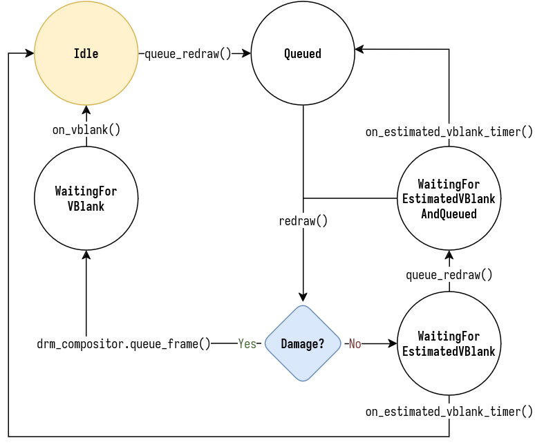

在 TTY 上，一次只能向输出提交一帧，合成器必须等待输出重绘（由 VBlank 指示）才能提交下一帧。
在 niri 中，我们通过 `OutputState` 中的 `RedrawState` 枚举来跟踪此过程。

以下是 `RedrawState` 状态机的状态转换图：

<picture>
    <source media="(prefers-color-scheme: dark)" srcset="./img/RedrawState-dark.drawio.png">
    
</picture>

`Idle` 是默认状态，此时输出不需要重绘。
任何可能导致屏幕更新的操作都会调用 `queue_redraw()`，将输出移至 `Queued` 状态。
然后，在事件循环分发结束时，niri 会对每个 `Queued` 输出调用 `redraw()`。

如果重绘导致损坏（例如，输出内容发生变化），我们将进入 `WaitingForVBlank` 状态，因为在收到 VBlank 事件之前我们无法进行重绘。
但是，如果没有损坏，我们不会立即返回到 `Idle` 状态。
相反，我们会设置一个定时器，使其在下一个 VBlank 事件发生时大致触发，并转换到 `WaitingForEstimatedVBlank` 状态。

这是必要的，目的是将发送给应用程序的帧回调限制在每个输出刷新周期最多一次。
如果没有这种限制，应用程序可能会开始持续重绘而不会造成任何损坏（例如，如果应用程序窗口部分位于屏幕外，并且只有屏幕外的部分发生变化），并且在此过程中消耗大量 CPU 资源。

然后，要么估计的 VBlank 定时器完成，我们回到 `Idle`，要么我们再次调用 `queue_redraw()` 并尝试再次重绘。
