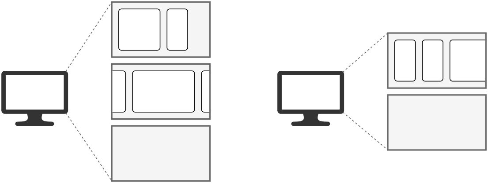

### 概述

Niri 具有动态工作区，可以在显示器之间移动。

每个显示器都包含一组垂直排列的独立工作区。
您可以使用 `focus-workspace-down` 和 `focus-workspace-up` 在一个显示器上的工作区之间切换。
“夹在中间”的空工作区在您切换离开时会自动消失。

每个显示器的末尾（底部）总会有一个空工作区。
当您在这个空工作区上打开一个窗口时，一个新的空工作区会立即在其下方出现。

您可以使用 `move-workspace-up/down` 在显示器上上下移动工作区。
如果想把窗口放到“中间”某个新建的工作区，做法是，将这个窗口放在最后一个（空的）工作区里，然后将该工作区移动到您需要的位置。

这是一幅示意图，展示了两台显示器及其各自的工作区。
左侧显示器有三个工作区（两个有窗口，加上一个空的），右侧显示器有两个工作区（一个有窗口，加上一个空的）。

<picture>
    <source media="(prefers-color-scheme: dark)" srcset="./img/workspaces-dark.png">
    
</picture>

您可以使用诸如 `move-workspace-to-monitor-left/right/up/down` 和 `move-workspace-to-monitor-next/previous` 之类的快捷键将工作区移动到不同的显示器。

当您断开一台显示器时，它上面的工作区将自动转移到另一台显示器上。
不过，它们也会“记住”其原来的显示器，因此当您重新连接上那台显示器时，工作区将自动移回到它上面。

> [!TIP]
> 在其他平铺窗口管理器里，您可能习惯于这样理解工作区：“这些都是我的工作区。我可以把“工作区 X”显示在第一台显示器上，把“工作区 Y”显示在第二台显示器上。”
> 而在 niri 中，请换成这种思路：“我的第一台显示器里放着这些工作区（包含 X、Y 等），第二台显示器里放着另外一些工作区。我可以让第一台显示器切换到工作区 X 或 Y；也可以把工作区 Y 整个搬到第二台显示器上去显示。”

### 按索引访问工作区

在 niri 中，有好几个操作都可以“通过索引”来定位访问工作区，例如：`focus-workspace 2`，`move-column-to-workspace 4`。
此处的索引指向的是当前焦点显示器上*实际位于*该索引位置的工作区。
因此，`focus-workspace 2` 永远会将您带到这台显示器的第二个工作区，无论该位置当前是什么工作区。

这与采用静态工作区系统的窗口管理器（WM）存在重要区别。
在 niri 中，工作区*本身不具备固定索引*。
如果您将第一个工作区移至显示器更靠后的位置，此时执行 focus-workspace 1 将会切换到另一个工作区（即原先排在第一个工作区之后的工作区）。

当您想在 niri 中拥有一个长期固定的工作区时，您可以在配置中创建一个[命名工作区](./Configuration:-Named-Workspaces.md)或通过 `set-workspace-name` 操作来设置。
此后即可通过名称调用这些工作区，例如执行 focus-workspace "browser"。命名工作区即使在内容（窗口）为空时也不会消失。

> [!TIP]
> 您可以尝试通过创建名为 “one”、“two”、“three” 等的工作区，并将按键绑定到 `focus-workspace "one"`、`focus-workspace "two"` 等操作来模拟静态工作区。
> 这种方法在某种程度上可行，但可能会带来一些混淆，因为您仍然可以上下移动这些工作区以及在显示器之间移动它们。
>
> 如果您是从静态工作区窗口管理器转来的用户，我建议*不要*这样做，而是尝试采用“niri的方式”——使用动态工作区，通过上下移动和聚焦来切换，而非依赖固定索引。
> 得益于可滚动的平铺布局，通常来说您需要的工作区比在传统平铺窗口管理器上需要的更少。

### 示例工作流

以下是我个人使用工作区的心得。

通常我会将浏览器放在最顶层的工作区，然后下面每个工作区对应一个正在进行的项目（或某项具体事务）。
在单个工作区内，包含有 1~2 个常驻显示器核心窗口（供频繁切换使用），偶尔还会有额外窗口被滚动到视野之外——这些通常是很少调用的辅助窗口或即将关闭的临时窗口。
当需要长期使用某个新窗口时，我会为其创建独立的工作区。

在工作过程中，我会动态调整工作区的排列顺序，确保所需内容能通过单一操作快速调用。
例如，由于经常需要在浏览器和当前任务间切换，我总是将正在处理的工作区紧贴在浏览器下方，这样只需执行一次 `focus-workspace-up/down` 就能直达我想要的位置。
